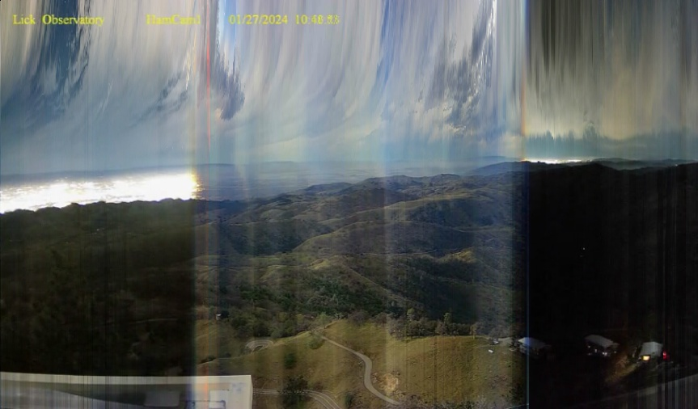

# Ham Cam Code

The [Ham Cams](https://mthamilton.ucolick.org/hamcam/) (especially [#1](https://mthamilton.ucolick.org/hamcam/hamcam1.html)) at the top of [Mount Hamilton, CA](https://en.wikipedia.org/wiki/Mount_Hamilton_(California)) are probably my all time favorite webcams.

This repository is a collection of code for processing and analyzing the Ham Cam videos. 

All of the examples use [OpenCV](https://github.com/NMoroney/macos-command_line_examples/tree/main/examples/mc_02_opencv) and for some of the examples, additional libraries are required.

---

* [hcc 01 extract jpegs](hcc_01_extract_jpegs/) : extract frames in the daily video as JPEGs
* [hcc 02 ave_rgb](hcc_02_ave_rgb/) : compute per frame RGB images for the daily video
* [hcc 03 aspect ratio](hcc_03_aspect_ratio/) : comparison of OpenCV capture aspect ratio vs per frame pixel dimensions
* [hcc 04 to gif](hcc_04_to_gif/) : generate spatially and temporally downscaled GIFs of the daily video (uses [FFmpeg](https://github.com/NMoroney/macos-command_line_examples/tree/main/examples/mc_13_ffmpeg))
* [hcc_05_time_gradients](hcc_05_time_gradients/) : generate time gradient where each column is from a corresponding frame
* [hcc_06_blueness_anomalies](hcc_06_blueness_anomalies/) : apply anomaly detection to average blueness (uses this [detector](https://github.com/ankane/AnomalyDetection.cpp))
