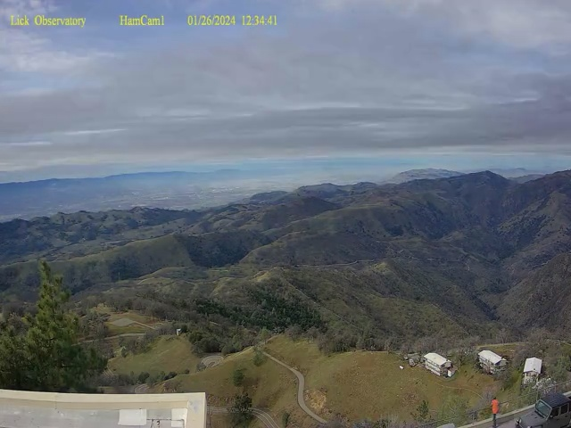

## Ham Cam : Extract Frames

For the first example, OpenCV is used to read the daily video file and then save each frame as a JPEG image.

In general, saving each frame to a file won't be used but it can be helpful to know how to extract frames.

