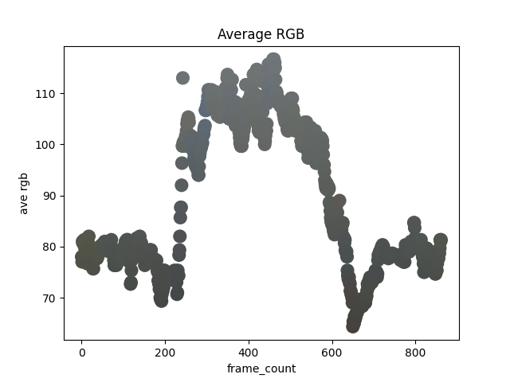

## Ham Cam : Average RGB

The [previous example](../hcc_01_extract_jpegs/) saved a JPEG image for every frame in the Ham Cam daily video.

This example computes a frame property, in this case the average RGB, and saves the values to a file.

The average RGB is not a partcularly fancy measure, but it is used in other examples (see [anomaliy detection](../hcc_06_blueness_anomalies/), [k-means](../hcj_07_kmeans_daylight/)).



The above plot shows the daily video as an XY scatter plot.

The X-axis of this plot is time or frame number and the Y-axis is ```(R+G+B)/3``` for the frame average RGB.
