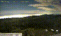

## Ham Came : Generate GIFs

This example sub-samples the Ham Cam daily video in time (fewer frames) and space (smaller frames).

Then [ffmpeg](https://github.com/NMoroney/macos-command_line_examples/tree/main/examples/mc_13_ffmpeg) is used to generate a GIF from the sub-sampled video.

Nothing fancy, but GIFs can be viewed directly in many contexts (such as from this github webpage).
