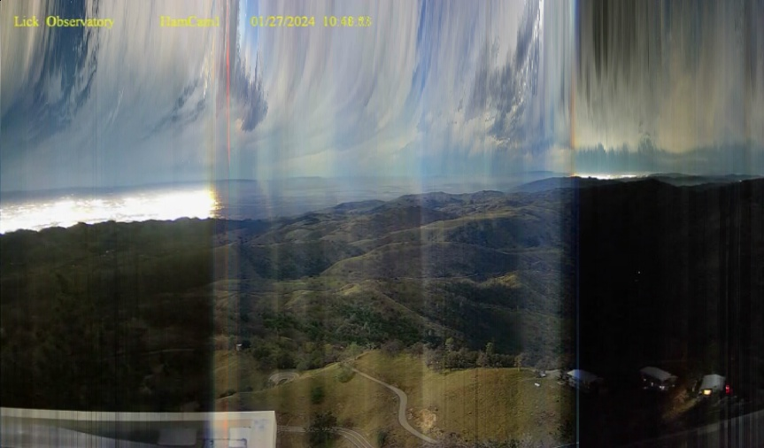

## Ham Cam : Time Gradients

Given that the Ham Cam webcam captures one frame roughly every 100 seconds, the result is 861 frames in the daily movie.

This example transforms the daily video into a time gradient by generating an image from left to right where each column of pixels is taken from the corresponding column of frame pixels.

That is the first or leftmost column of pixels is taken from the first frame.

Likewise, the last or rightmost column of pixels is taken from the last frame. The time of day then progresses from left to right.

The resulting time gradient for January 27, 2024 is shown below.

Sunrise and sunset are evident in this image, as are the clouds. 

---

* **to-do** : add more examples of interest (atmospheric rivers, clear summer days, etc).
