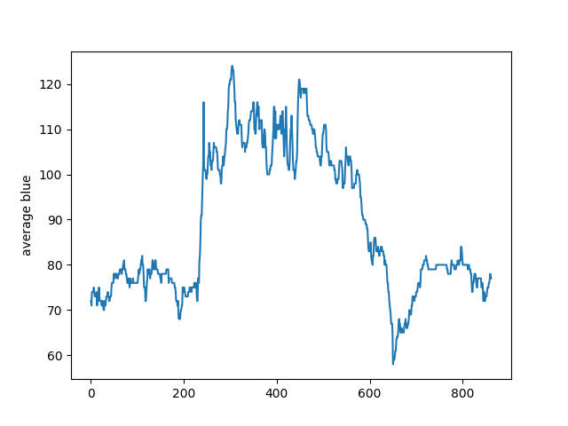
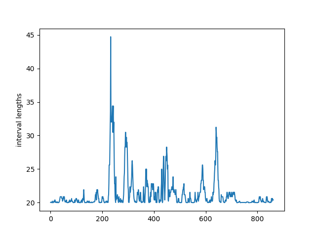
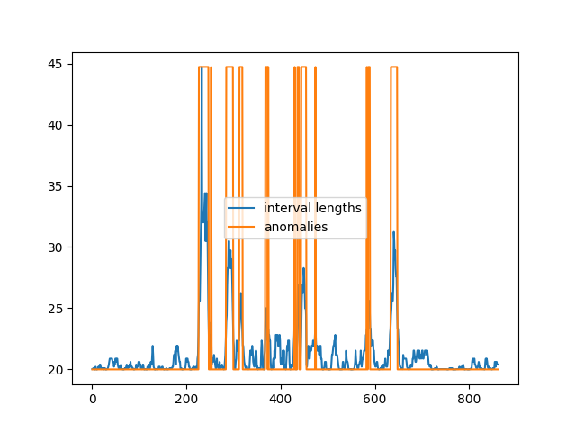
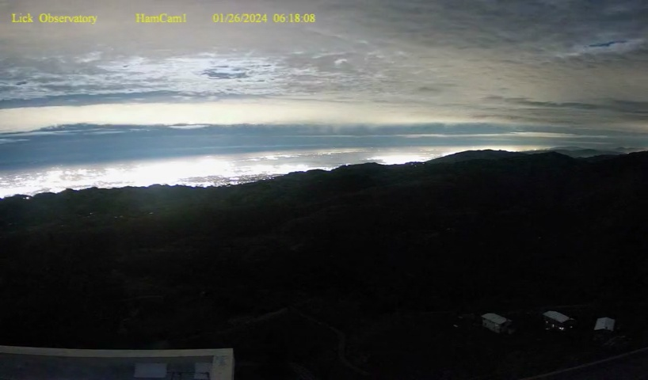
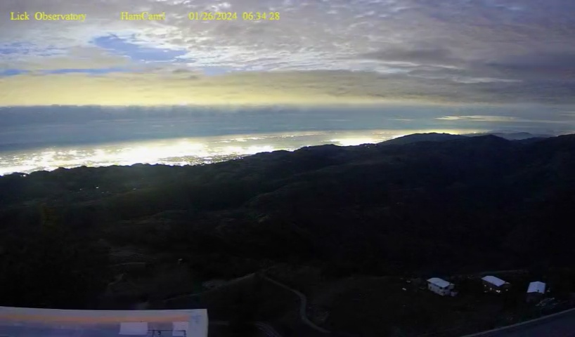
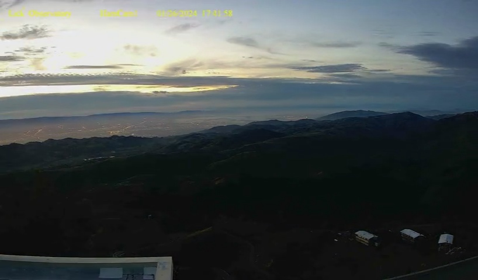
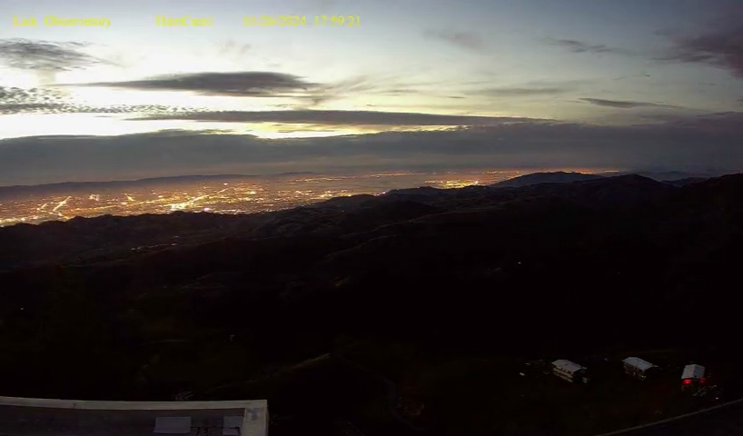

## Ham Cam : Blueness Anomalies

This example builds on the [average per frame RGB](../hcc_02_ave_rgb/) computation and applies [anomaly detection](https://github.com/ankane/AnomalyDetection.cpp) to the blueness channel.

To illustrate, for January 26, 2024 the average per frame blueness can be plotted :

Looks like something happening a bit after frames 200 and 600?

To explore, the average blueness is transformed to interval lengths or a finite positive measure of 2D change :

Applying [anomaly detection](https://github.com/ankane/AnomalyDetection.cpp) to the above yields the anomalies below shown in orange :

And extracting two frames around the first and last blueness anomalies :

| 226 | 236 | 636 | 646 |
| --- | --- | --- | --- |
|  6:18am |  6:34am |  5:41pm |  5:59pm - *SJC, Lights Up!* | 

---

* adjust default matplotlib legend for plotting anomalies (ie not in center)?
* dig into details of [civil, nautical and astronomical twilights](https://en.wikipedia.org/wiki/Sunset).
